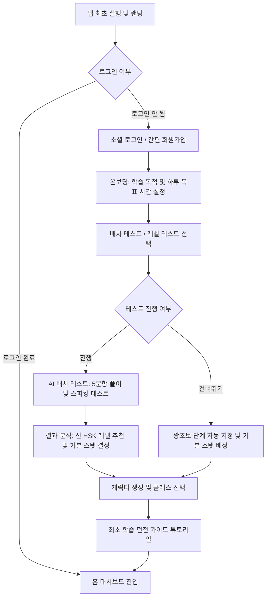
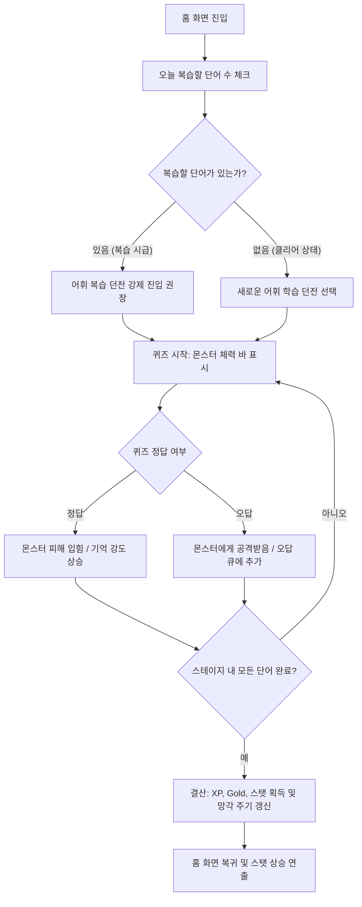
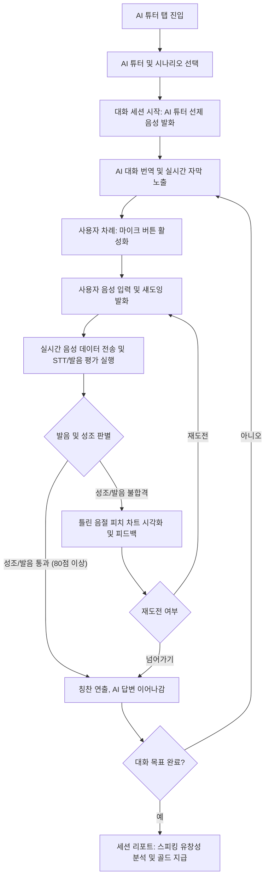
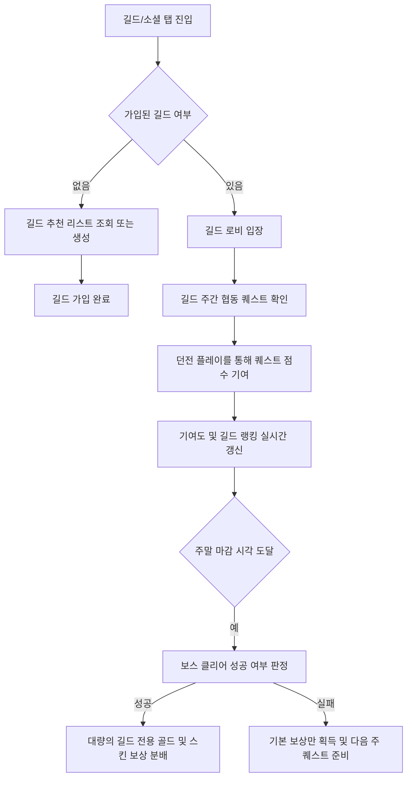
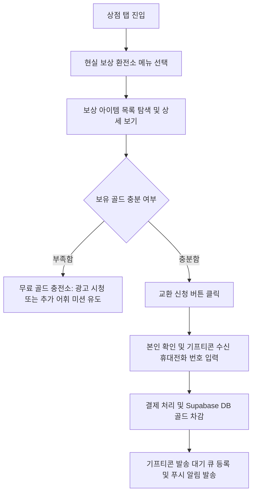

# [중국어 학습 웹앱] 사용자 플로우 (User Flow)

본 문서는 서비스의 핵심 시나리오 5종에 대한 사용자 경험 흐름을 도식화하고 상세 단계를 정의하는 사용자 플로우(User Flow) 설계서입니다.

---

## 1. 회원가입, 온보딩 및 배치 테스트 플로우

새로운 사용자가 앱에 진입하여 자신의 수준을 측정하고, 캐릭터를 생성하여 최초로 학습에 안착하기까지의 과정입니다.

### 상세 단계 설명:
1.  **소셜 로그인**: 카카오톡 또는 구글 계정을 통해 3초 만에 회원가입을 완료합니다.
2.  **온보딩 설정**: "취업/이직", "여행", "자기계발" 등 목적과 "하루 15분(보통)", "하루 30분(열공)" 등의 복습 강도를 설정합니다.
3.  **배치 테스트**: AI가 학습자의 발음과 어휘력을 측정하는 5개의 미니 게임을 통해 적절한 난이도의 스테이지(예: HSK 1급 수준, 3급 수준)를 자동으로 제안합니다.
4.  **캐릭터 생성**: 자신의 부캐 역할을 할 학습 파트너 캐릭터의 외형 및 성격 클래스(어휘 집중형, 회화 집중형 등)를 설정합니다.

---

## 2. 일일 학습 및 망각 곡선 기반 어휘 복습 루프

어휘력을 나타내는 STR 스탯을 올리고, 망각곡선 주기상 복습해야 하는 단어를 몬스터와 매칭하여 해결하는 핵심 학습 루프입니다.

### 상세 단계 설명:
1.  **복습 알림**: 앱 진입 시 `user_vocabulary_progress` 테이블을 조회하여 현재 망각 임계값 이하로 떨어진 단어가 있을 경우 빨간색 "던전 침공" 연출을 띄워 복습을 최우선으로 유도합니다.
2.  **전투형 퀴즈**: 단어가 적힌 카드를 보고 뜻을 맞추거나 한자 획순을 맞출 때마다 몬스터의 HP가 감소합니다.
3.  **기억 강도 반영**: 답변의 정확도와 속도가 우수하면 복습 간격(Interval)이 2배로 늘어나며, 오답인 경우 당일 내 재학습 큐에 들어가 즉시 다시 출제됩니다.

---

## 3. AI 튜터 상황극 및 섀도잉 세션 플로우

말하기 유창성(DEX) 및 성조 정확성(INT)을 훈련하기 위한 AI 오디오 챗 기반 롤플레이 플로우입니다.

### 상세 단계 설명:
1.  **시나리오 선택**: "카페에서 주문하기"와 같은 일상적 상황을 고르면 AI 튜터가 적합한 표정과 억양으로 말을 겁니다.
2.  **발음 평가**: 사용자의 음성을 녹음하여 Pinyin 단위로 쪼개고, 4성 성조의 정확도를 체크합니다.
3.  **피치 피드백**: "중국어 3성의 끝부분을 더 내리지 못했습니다"와 같은 실시간 교정 피드백과 함께 원어민의 음성 파형과 겹쳐볼 수 있는 비주얼 차트를 표시합니다.

---

## 4. 길드 가입 및 협동 퀘스트 플로우

유저 간 리텐션을 극대화하기 위한 소셜 협동 및 경쟁 흐름입니다.

---

## 5. 현실 보상 교환 플로우

열심히 학습하여 모은 가상 재화(골드)를 현실의 커피 기프티콘이나 편의점 상품권으로 바꾸는 환전 유저 저니입니다.

