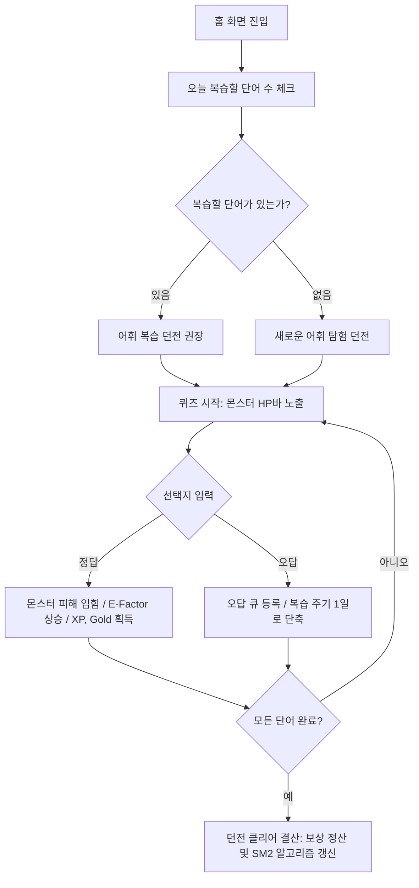
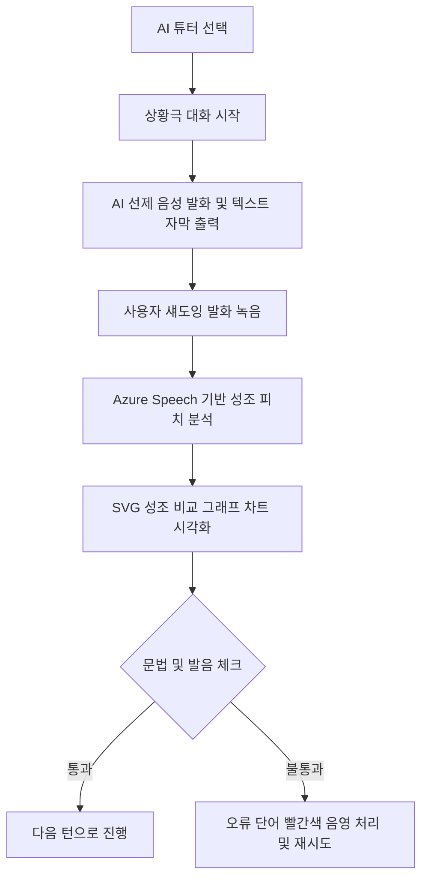

# [JEONGO] 통합 서비스 기획 및 제품 상세 요구 사양서 (PRD)

본 문서는 한국인을 위한 혁신적인 게임형 중국어 학습 웹 애플리케이션 **JEONGO (전고)**의 컨셉, 정보 구조(IA), 사용자 흐름, UI/UX 설계, 데이터베이스 구조 및 핵심 기능 API 규격을 하나로 통합한 제품 상세 요구 사양서(PRD)입니다.

---

## 1. 서비스 개요 및 제품 정의 (Service Overview)

### 1.1 서비스 아이덴티티
*   **서비스명**: **JEONGO (전고 - 戰鼓 / 戰GO)**
*   **슬로건**: *"중국어 공부는 끝났다. 이제 중국어 던전으로 로그인하라!"*
*   **비주얼 컨셉**: **Apple의 심플함 + Notion의 깔끔한 가독성 + Duolingo의 위트 있는 인터랙션**
    *   **Glassmorphism & Sleek Dark Mode**: 미래지향적이며 눈의 피로를 덜어주는 어두운 테마 기반 투명 유리 카드 레이아웃.
    *   **PWA 기반 모바일 퍼스트**: 모바일 웹 브라우저에서 즉시 앱처럼 동작하며 푸시 알림 및 오프라인 로컬 캐시 학습 지원.

### 1.2 핵심 포지셔닝 및 경쟁사 극복 방안
기존 유명 서비스들의 약점을 상호 보완하여 하나의 완결된 RPG 학습 루프로 통합합니다.

*   **Duolingo의 한계 극복**: 단순 기계적 반복 대신 **어휘 스탯 실시간 반영** 및 **스토리 대화** 결합.
*   **말해보카의 한계 극복**: 단어 암기에 머무르지 않고, 외운 단어를 **AI 튜터 회화 세션에서 실전 발화**하도록 유기적 연결.
*   **Speak의 한계 극복**: 단순 스피킹을 넘어 **캐릭터 육성(RPG 스탯 분배)** 및 **현실 보상 환전 시스템**으로 리텐션(지속성) 확보.

---

## 2. 정보 구조도 (Information Architecture)

앱은 하단의 **5-Tab Bottom Navigation Bar**를 중심으로 구조화됩니다.

```
[GNB: 하단 탭바]
  ├── 🏰 홈 & 캐릭터 (Home / Status)
  │     ├── 내 캐릭터 정보 (레벨, 아바타 스킨, 보유 재화)
  │     ├── 스탯 분배 판넬 (STR-어휘력, DEX-유창성, INT-성조력, VIT-연속성)
  │     ├── 일일 모험 퀘스트 리스트 (경험치 및 골드 보상 청구)
  │     └── 약점 분석 레이더 차트
  │
  ├── ⚔️ 학습 던전 (Learn / Battle)
  │     ├── 어휘 복습 던전 (망각곡선 스케줄러와 연동된 단어 카드 퀴즈)
  │     ├── 신대륙 탐험 던전 (새로운 한자/어휘 학습 스테이지)
  │     └── 보스 레이드 퀴즈 (인게임 힌트 물약 아이템 사용 가능)
  │
  ├── 🗣️ AI 튜터 (AI Conversation)
  │     ├── AI 튜터 선택 (친절한 왕선생, 친구 릴리, 독설 교관 리)
  │     ├── 상황극 회화 룸 (음성 마이크 인식 기반 대화 핑퐁)
  │     └── SVG 성조 피치 대조 분석기 (원어민 vs 내 발음 주파수 라인 차트)
  │
  ├── 👥 소셜 & 길드 (Social / Guild)
  │     ├── 주간 리그 랭킹 (동적 강등/승급 타이머 탑재)
  │     └── 길드 보스 레이드 (길드원 전체가 골드를 공헌하여 마왕 토벌)
  │
  └── 🎁 현실 상점 (Reward Shop)
        ├── 아이템 및 스킨 상점 (골드로 아바타 스킨 해금)
        └── 현실 보상 환전소 (골드를 스타벅스 커피, 네이버페이로 환전하는 모바일 SMS 모달)
```

---

## 3. 핵심 사용자 플로우 (User Flow)

### 3.1 망각 곡선 어휘 복습 던전 전투 루프
학습자가 어휘 던전에서 문제를 풀며 스탯을 올리고 망각 간격을 조정하는 핵심 게임 루프입니다.



### 3.2 AI 튜터 음성 대화 및 성조 피치 비교 흐름


---

## 4. UI/UX 디자인 가이드라인

### 4.1 컬러 팔레트 (CSS 변수)
*   **배경색 (Dark Background)**: `hsl(220, 25%, 7%)`
*   **유리 카드 (Glass Card)**: `hsla(220, 20%, 15%, 0.6)` + `backdrop-filter: blur(20px)`
*   **네온 테마 컬러**:
    *   `STR (어휘/Green)`: `hsl(142, 70%, 50%)`
    *   `DEX (유창성/Cyan)`: `hsl(180, 80%, 50%)`
    *   `INT (성조/Violet)`: `hsl(260, 80%, 65%)`
    *   `VIT (연속/Rose)`: `hsl(340, 80%, 60%)`
    *   `GOLD (보상/Yellow)`: `hsl(48, 95%, 50%)`

### 4.2 주요 와이어프레임 설계 스펙
*   **성조 피치 차트**: 가로형 SVG 캔버스 위에 원어민 피칭 주파수(점선)와 학습자 피칭 주파수(실선)를 오버레이하여 주파수 꺾임새를 정밀하게 표현.
*   **길드 보스 레이드**: 보스 몬스터 카드 주위에 붉은 네온 글로우(`glow-rose`) 효과를 붉게 펄싱하여 레이드 협동 상황을 박진감 있게 연출.

---

## 5. 데이터베이스 스키마 설계 (PostgreSQL / Supabase DDL)

데이터 일관성과 게임형 스탯 처리를 위한 관계형 데이터베이스 상세 스펙입니다.

```sql
-- 1. 사용자 통계 및 캐릭터 스탯
CREATE TABLE public.user_stats (
    user_id UUID REFERENCES auth.users(id) ON DELETE CASCADE PRIMARY KEY,
    nickname VARCHAR(50) UNIQUE NOT NULL,
    avatar_skin_id VARCHAR(100) DEFAULT 'default_explorer',
    level INT DEFAULT 1 NOT NULL,
    xp INT DEFAULT 0 NOT NULL,
    gold INT DEFAULT 500 NOT NULL,
    streak_count INT DEFAULT 0 NOT NULL,
    
    -- RPG 스탯
    stat_str_vocab INT DEFAULT 10 NOT NULL,
    stat_dex_fluency INT DEFAULT 10 NOT NULL,
    stat_int_tone INT DEFAULT 10 NOT NULL,
    stat_vit_attendance INT DEFAULT 10 NOT NULL,
    stat_points_available INT DEFAULT 0 NOT NULL
);

-- 2. 단어 복습 상태 (Spaced Repetition SM2 변수 포함)
CREATE TABLE public.user_vocabulary_progress (
    id BIGSERIAL PRIMARY KEY,
    user_id UUID REFERENCES auth.users(id) ON DELETE CASCADE NOT NULL,
    vocab_id INT REFERENCES public.vocabulary_items(id) ON DELETE CASCADE NOT NULL,
    easiness_factor REAL DEFAULT 2.5 NOT NULL,       -- E-Factor
    repetitions INT DEFAULT 0 NOT NULL,               -- 반복 횟수
    interval_days INT DEFAULT 0 NOT NULL,             -- 복습 간격
    next_review_at TIMESTAMP WITH TIME ZONE DEFAULT NOW() NOT NULL,
    is_mastered BOOLEAN DEFAULT FALSE NOT NULL,
    UNIQUE(user_id, vocab_id)
);
```

---

## 6. 핵심 비즈니스 로직 및 기능 명세

### 6.1 SuperMemo-2 Spaced Repetition 복습 주기 산출식
학습자가 단어 퀴즈에 응답했을 때 매겨진 품질 점수(`q`, 1~5)에 따라 다음 복습 간격(`I`)을 계산합니다.

$$\text{Repetitions } (n) = \begin{cases} n + 1 & \text{if } q \ge 3 \\ 0 & \text{if } q < 3 \end{cases}$$

$$\text{Interval } (I) = \begin{cases} 1 & \text{if } n = 1 \\ 6 & \text{if } n = 2 \\ I_{n-1} \times EF & \text{if } n > 2 \end{cases}$$

$$\text{Easiness Factor } (EF) = \max(1.3, EF + (0.1 - (5 - q) \times (0.08 + (5 - q) \times 0.02)))$$

### 6.2 오프라인 학습 보전 (IndexedDB/Local Cache)
오프라인 학습 완료 시점 로그를 `localStorage` 내 `offline_learning_logs` 배열에 순차적으로 캐싱한 뒤, PWA가 온라인 연결 상태(`navigator.onLine == true`)로 복구되면 백그라운드에서 동기화 스크립트를 즉시 실행하여 Supabase DB와 원격 동기화(Bulk Upsert)를 수행합니다.
